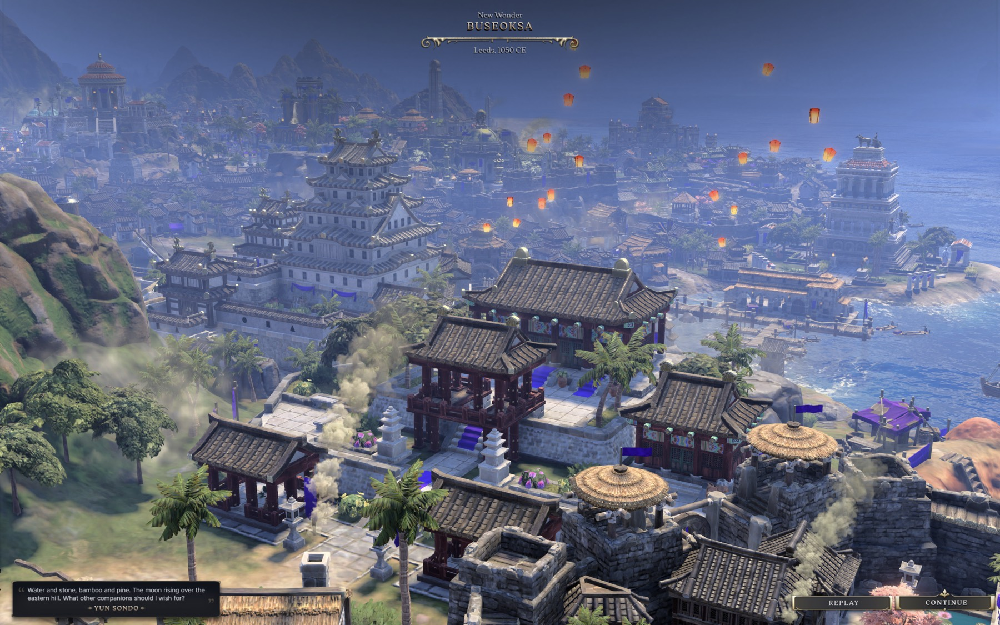
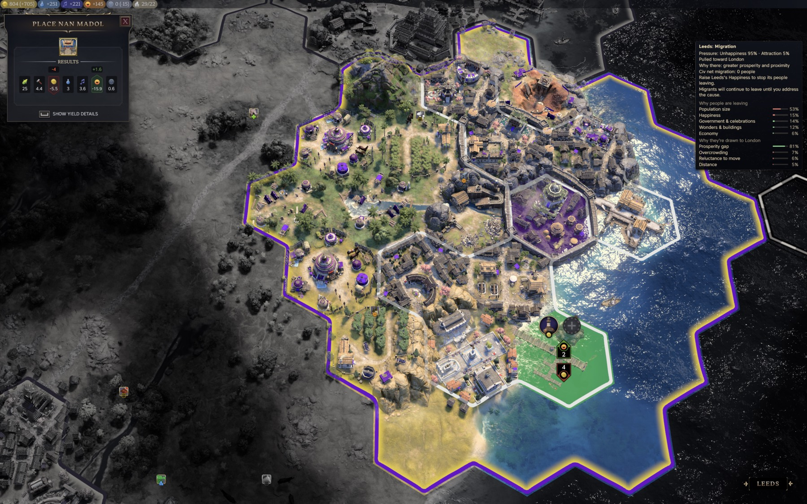
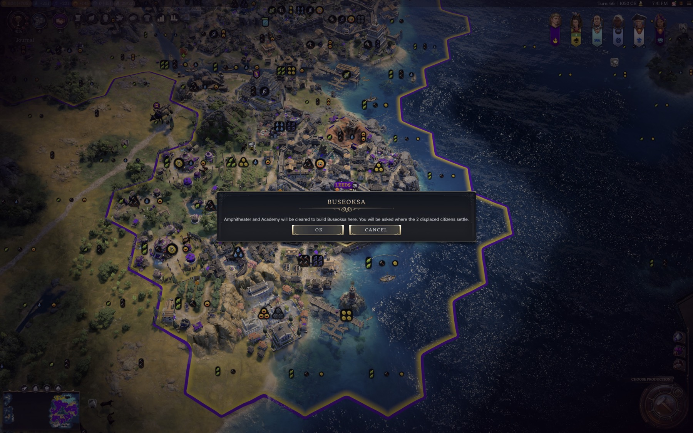
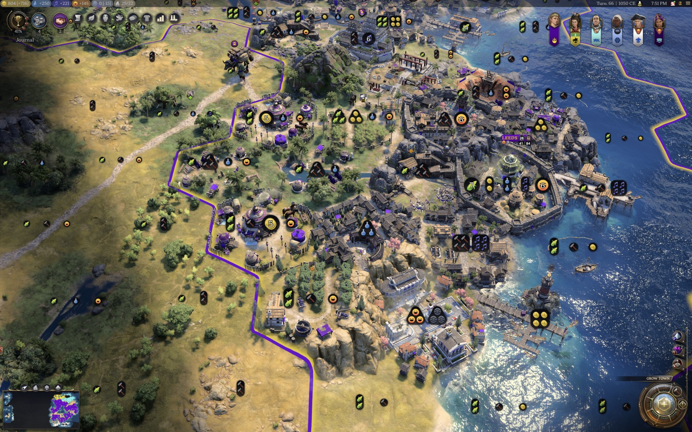

# Build Wonders Over Antiquated Buildings

A Civilization VII mod. A city that filled its centre in Antiquity has nowhere left to put a Wonder. This mod
lets you build one over the buildings that age left behind: urban tiles whose buildings are all from an earlier
age are offered on the Wonder placement screen, the old buildings are cleared, the walls stay, and the citizens
they housed are yours to place through the game's own Grow City prompt.



*The game's own Wonder cinematic for a Wonder built this way. It is an ordinary Wonder: the tile is a real
`DISTRICT_WONDER`, and nothing about Wonders is redefined anywhere.*

There is no database change. Wonders keep their class, their one-in-the-world uniqueness, their cinematics, their
terrain rules, the adjacency their neighbours read from a Wonder district, and whatever the AI does with them. The
mod clears a tile and lets the game build on it, exactly as the game would build on any bare tile.

---

## What the player does

Pick a Wonder in production. Urban tiles holding only antiquated buildings now show as valid sites alongside the
usual ones.



*The placement screen, with the mod's tile selected and the yield result the mod computes for it.*

Choose one, and a confirmation, titled with the Wonder's name, names the buildings that will be cleared, says how
many displaced citizens you will be asked to place, and says the walls stay when the tile has any. Cancel and
nothing happens.



*"Amphitheater and Academy will be cleared to build Buseoksa here. You will be asked where the 2 displaced
citizens settle."*

Confirm, and the buildings' demolition, the district's demolition and the Wonder's build order all go to the game
in the same instant, so the tile goes straight from its old buildings to the Wonder's construction site and no
empty ground is ever drawn. Walls come down with the district and are re-created on the Wonder's district a
moment after it lands. Once the Wonder is standing, one citizen per building that housed one becomes pending
population, and before the turn can end the game's own Grow City prompt asks where each settles - a rural tile
or a specialist seat, wherever you like.



*The displaced citizens arrive as ordinary pending population, placed on the game's own screen. The city's head
count is unchanged once they are placed.*

## Which tiles qualify

| Tile holds | Offered |
| --- | --- |
| one antiquated building, free slot or not | yes |
| two or more antiquated buildings | yes |
| one antiquated beside one current-age | no |
| two current-age | no |
| anything Ageless - the Palace, the City Hall, a Harbor, unique-quarter buildings, Wonders | no |
| walls, alongside any of the above | walls neither qualify a tile nor block it, and are kept |

Antiquated means a previous age and not Ageless. The engine enforces none of this on its own - left alone it will
offer any terrain-valid urban tile whatever stands on it - so this rule is the only thing that decides what is
ever cleared. It lives in `lib/bwab-eligibility.js` with 23 tests.

## Which Wonders are offered a tile

The mod decides **where** a Wonder may go. It never decides **whether** one may be built. A Wonder that is locked,
not yet unlocked, or already standing somewhere in the world stays refused, exactly as the base game refuses it.
Only a refusal that says there is nowhere to put it is this mod's business.

That distinction is load-bearing. Measured in one city: of 48 Wonders, 2 were buildable, 42 were refused for
reasons that have nothing to do with any tile, and 4 were refused for want of a site. Only those last 4 are ones
this mod can help with.

The Wonder's own placement rules are then checked before a tile is offered for it: terrain, biome, no-feature,
river (required or forbidden), adjacent terrain, adjacent district, adjacent mountain, adjacent constructible,
invalid adjacent biomes, homeland or distant lands, and a required constructible in the settlement - every
placement rule the game's data holds for a Wonder. A rule the mod does not evaluate excludes that Wonder rather
than guessing: a Wonder that must stand on a feature, beside a lake, or on an appeal-chosen site is never
offered an antiquated tile, and neither is one that uses a rule table no Wonder uses today (required or invalid
features, feature classes, resources, river placement), should a future Wonder use one. So the mod will
sometimes offer less than the game would allow and never more.

The five Wonders that stand on Coast follow placement rules the game keeps to itself, so a coastal urban tile
(a Lighthouse or Fishing Quay) is offered to one of them only when the game already accepts that Wonder on a
bare coast tile of the same city.

## If the game refuses the site after all

Civilization VII will not say whether a Wonder fits a tile until the tile is empty, and it enforces placement
rules that are not in the data a mod can read. So a cleared tile can still be turned down.

The build order goes to the game together with the clear, so a refusal shows up as the tile failing to become a
Wonder site. The mod watches the tile for about three seconds; if the Wonder has not appeared by then, it puts
the tile back: the buildings it destroyed are re-created, then the walls, and it reads the tile afterwards to
confirm everything is standing. No citizens are displaced, because they are only added once the Wonder is on the
tile. The hex is empty for those few seconds and then holds what it held before. Watched on a coastal Wonder
whose every readable rule passed and which the engine still refused - the tile came back holding its Lighthouse,
with population, urban and rural counts unchanged and nothing left pending. The cost of a refusal is a wasted
confirmation, not a lost building.

## The yield preview

A tile the mod adds is not one the engine prepared placement data for, so the placement panel has nothing of its
own to show for it. The mod answers with its own figure, built from the game's per-constructible numbers: the
Wonder's base yields, minus the yields of the buildings that would go, plus the maintenance they would stop
costing.

It is a first-order figure. Yields a Wonder grants conditionally, and adjacency the old buildings were receiving,
are not modelled. No Wonder in the game has adjacency rows of its own, which is why the Wonder side of the
subtraction is exact.

## What it costs you

The tile. Those buildings' yields and maintenance are gone, the city has fewer building slots, and the tile holds
the Wonder from then on. The citizens are not lost: the head count is unchanged once you have placed them.

## Compatibility

- **No database change**, so a save loads with the mod on or off, and it can join a game already in progress. A
  Wonder built this way is ordinary constructible state.
- **No base-game files are replaced**, and mods that adjust Wonder data are unaffected, because this mod does not
  touch Wonder data.
- **Your own city only.** The clear and the build are the local player's own actions on the local player's own
  settlement. The AI builds Wonders exactly as it always has.
- **Multiplayer.** Watched in a live LAN game: the clear, the build and the displaced citizens all went through
  the network session, and a competing placement was refused by the game and rolled back intact.
- English only for now. The mod's text is six strings, so a translation is a small job.

## Installation

1. Subscribe on the Steam Workshop, or download the zip from the
   [latest release](https://github.com/tmtmiller1/civilization-vii_build_wonders_over_antiquated_buildings/releases/latest).
2. Unzip it so the `build-wonders-over-antiquated-buildings` folder sits in the Civilization VII Mods directory.
3. Enable **Build Wonders Over Antiquated Buildings** from Additional Content in-game.

## Status

Watched working end to end on Civilization VII 1.5.0, 2026-09-24, including a real mouse click on the hex, both
the one-building and two-building cases, walls preserved on a hill tile, population conserved on both, the
confirmation rendering and driving the clear, the yield preview reading on the hex and in the panel, and a
refusal rolling the tile back with nothing lost, the whole thing in a live LAN game, and the tile going from
its buildings straight to the Wonder's construction site with no empty ground drawn in between. Every step and
the run that proved it is in [docs/RECIPE.md](docs/RECIPE.md).

## Layout

```
build-wonders-over-antiquated-buildings.modinfo   one script, no data
ui/bwab-clear-and-build.js          the mod: placement-screen hooks, the clear, the walls, the yield preview, the rollback
lib/bwab-eligibility.js             the antiquated-tile rule, engine-free, 23 tests
text/en_us/ModText.xml              name, description, the confirmation text
tests/eligibility.mjs               the rule's tests
docs/RECIPE.md                      every step and the run that proved it
docs/steam-workshop-description.md  the Workshop page text
docs/logo.svg, docs/logo.png        the Workshop preview image
gallery/                            the screenshots used above
devtools/README.md                  where the harness lives (mod_ideas_tested) and the one command to re-verify
eslint.config.js, tsconfig.json, types/, package.json, scripts/   dev tooling, not shipped
install-dev.sh                      copies the mod into the game's Mods folder
```

`npm run verify` runs everything that can be checked without the game: `tsc --noEmit` over the JSDoc types,
`eslint ui lib`, and the eligibility tests. Zero errors and zero warnings is the bar. `npm run readme:pdf` builds
`README.pdf` from this file.

In a running game, `globalThis.__bwab.enabled = false` makes every hook pass straight through, and
`globalThis.__bwab.uninstall()` restores the engine's own methods; both are for troubleshooting.

The routes that were tried and set aside, the probes, and the harness runs live in the author's working tree
(`mod_ideas_tested/build_wonders_over_antiquated_buildings`), outside this repository; `devtools/README.md` lists
the runs that verify this build.

## Credits

Built by Tower. MIT licensed.
